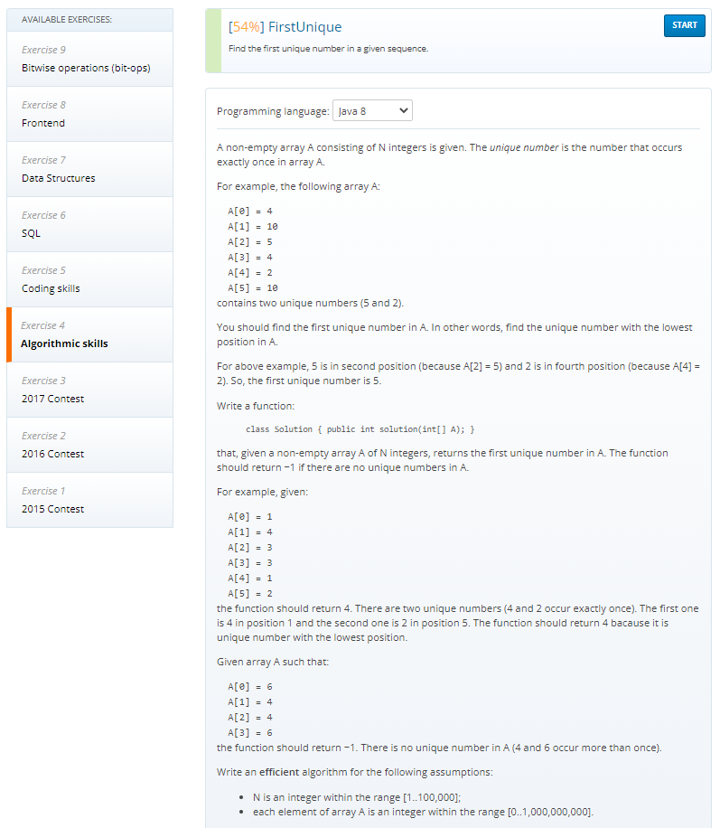
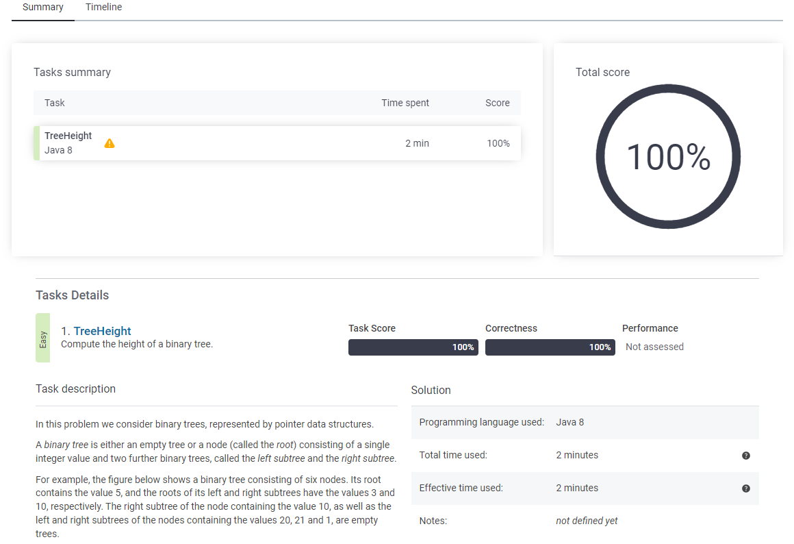
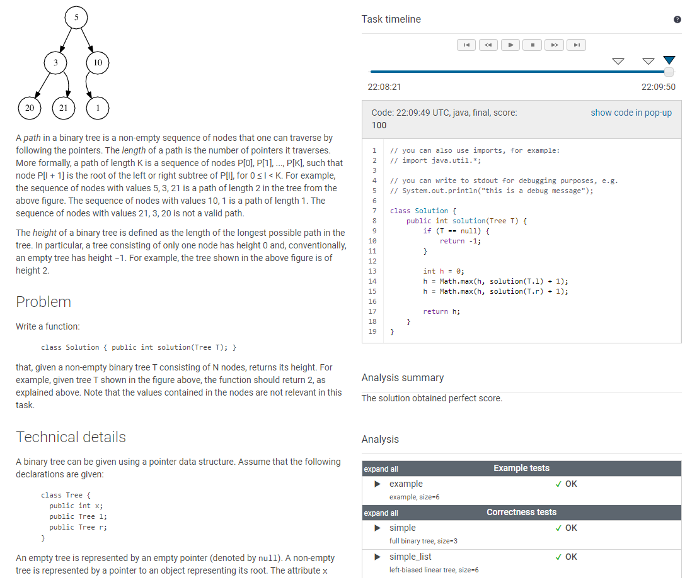
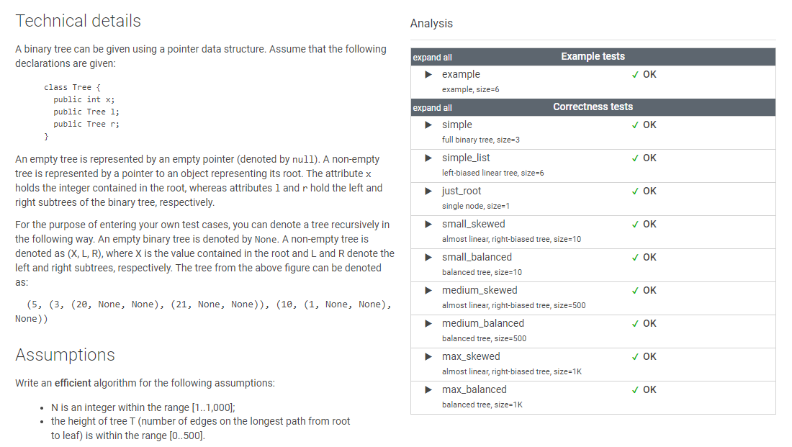
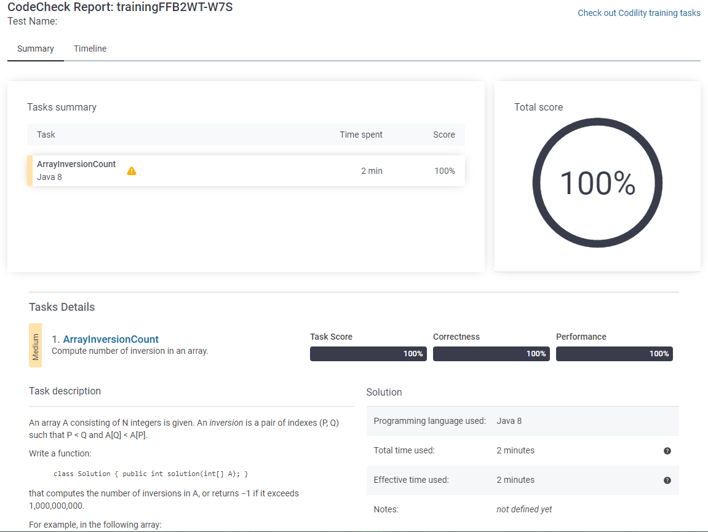
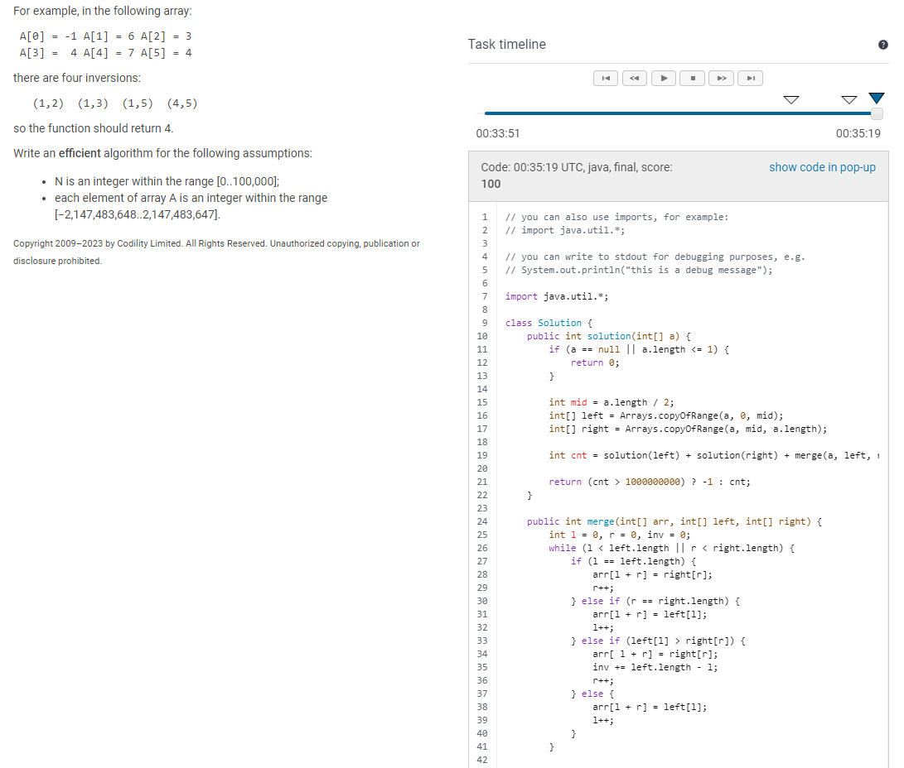
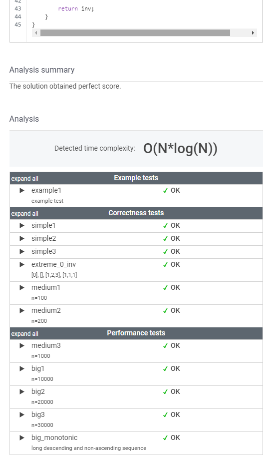
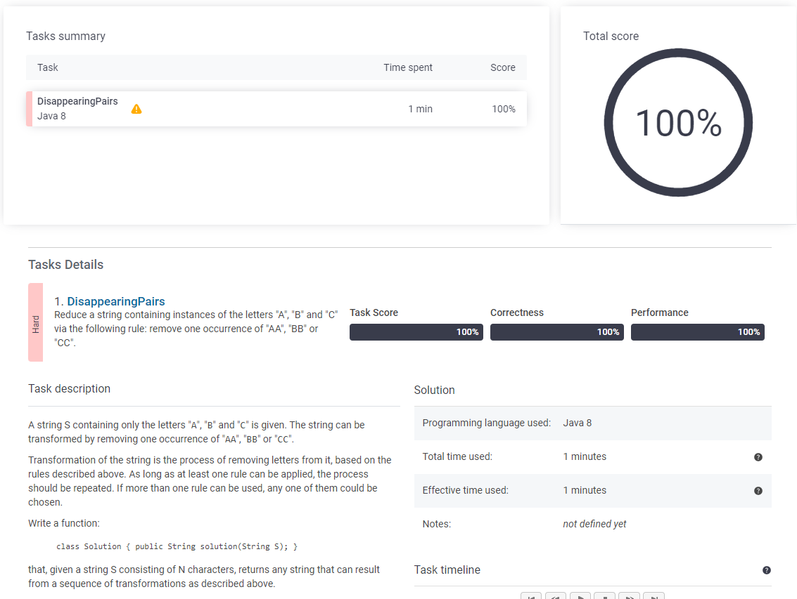
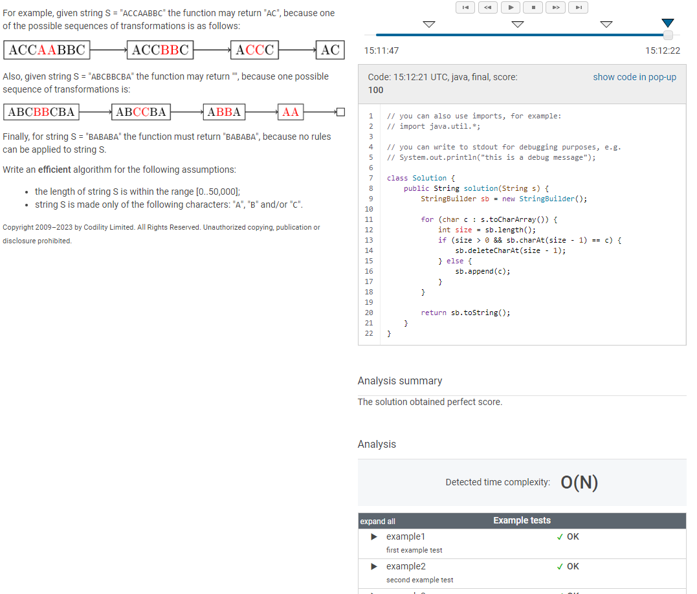
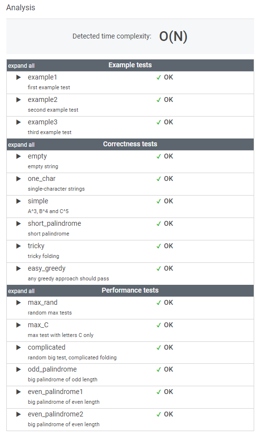

# Codility_ Exercises

## Algorithmic skills

### FirstUnique



<!--
O(N**2)

54%

```java
import java.util.stream.Collectors;
import java.util.*;

class Solution {
    public int solution(int[] a) {
        Set<Integer> aSet = Arrays.stream(a).boxed().collect(Collectors.toSet());

        List<Integer> aList = Arrays.stream(a).boxed().collect(Collectors.toList());

        // aList.stream().filter(x -> x > 0);
        for (int i = 0; i < a.length; i++) {
            if (Collections.frequency(aList, a[i]) == 1) {
                return a[i];
            }
        }

        return -1;
    }
}
```

-->

O(N * log(N))

100%


## StrSymmetryPoint

O(length(S))

100%


## TreeHeight







## ArrayInversionCount







## DisappearingPairs







## PolygonConcavityIndex
