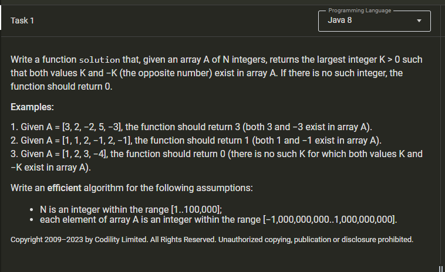
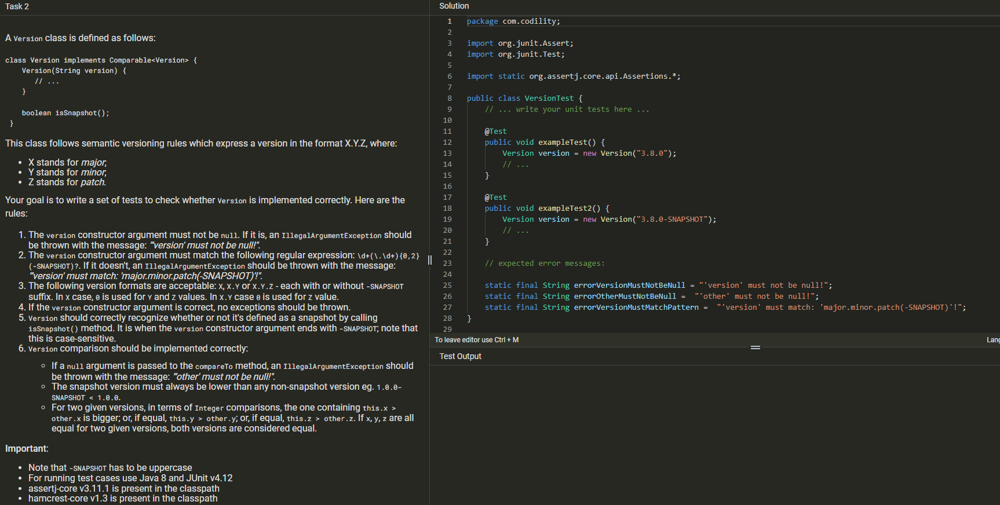
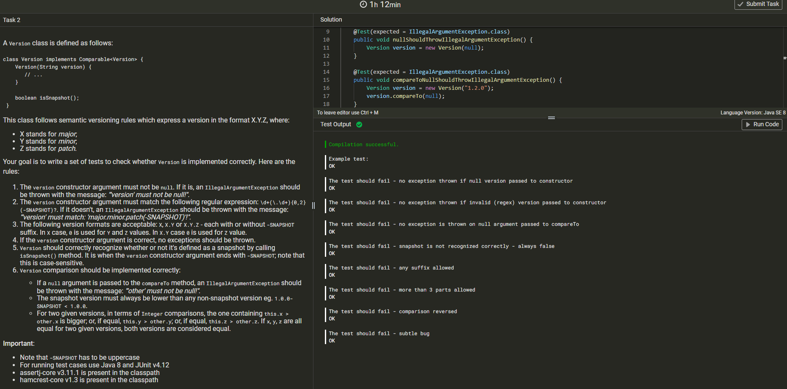
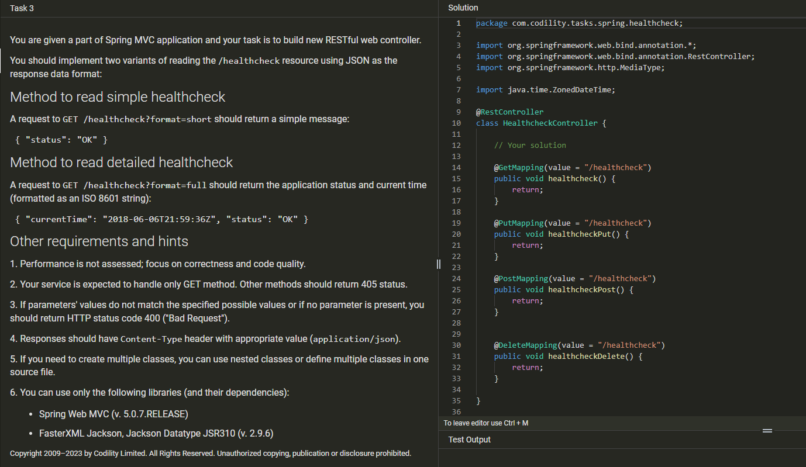
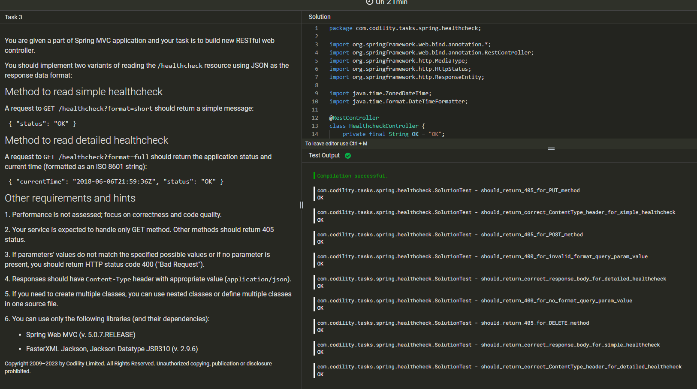

# MyCodility_

My Codility_

## Exercises

[Exercises](Exercises.md)





```java
package com.codility;

import org.junit.Assert;
import org.junit.Test;

import static org.assertj.core.api.Assertions.*;

public class VersionTest {    
    @Test(expected = IllegalArgumentException.class)
    public void nullShouldThrowIllegalArgumentException() {
        Version version = new Version(null);
    }

    @Test(expected = IllegalArgumentException.class)
    public void compareToNullShouldThrowIllegalArgumentException() {
        Version version = new Version("1.2.0");
        version.compareTo(null);
    }

    @Test(expected = IllegalArgumentException.class)
    public void moreThanThreePartsShouldThrowIllegalArgumentExceptionCase1() {
        Version version = new Version("7.6.0.1");
    }

    @Test(expected = IllegalArgumentException.class)
    public void moreThanThreePartsShouldThrowIllegalArgumentExceptionCase2() {
        Version version = new Version("9.13.0.2-SNAPSHOT");
    }

    @Test(expected = IllegalArgumentException.class)
    public void onlySnapshotSuffixIsAllowed() {
        try {
            Version version = new Version("9.13.0-A");
        } catch (IllegalArgumentException iae) {
            assertThat(iae.getMessage().equalsIgnoreCase(errorVersionMustMatchPattern)).isTrue();
            throw iae;
        }
        fail(errorVersionMustMatchPattern);
    }

    @Test
    public void noSnapshotSuffixShouldReturnFalseOnIsSnapshot() {
        Version version = new Version("3.8.0");
        assertThat(version.isSnapshot()).isFalse();
    }

    @Test
    public void hasSnapshotSuffixShouldReturnTrueOnIsSnapshot() {
        Version version = new Version("3.8.0-SNAPSHOT");
        assertThat(version.isSnapshot()).isTrue();
    }

    @Test
    public void comparisonShouldWorkAsExpected() {
        Version version1 = new Version("3.8.0-SNAPSHOT");
        Version version2 = new Version("3.8.0");
        assertThat(version1.compareTo(version2) < 0).isTrue();
        Version version3 = new Version("3.8.1");
        Version version4 = new Version("3.8.2");
        assertThat(version3.compareTo(version4) < 0).isTrue();
        Version version5 = new Version("3.8.3");
        Version version6 = new Version("3.9.1");
        assertThat(version5.compareTo(version6) < 0).isTrue();
        Version version7 = new Version("3.8.3");
        Version version8 = new Version("4.0.2");
        assertThat(version7.compareTo(version8) < 0).isTrue();
    }

    // expected error messages:

    static final String errorVersionMustNotBeNull = "'version' must not be null!";
    static final String errorOtherMustNotBeNull =  "'other' must not be null!";
    static final String errorVersionMustMatchPattern =  "'version' must match: 'major.minor.patch(-SNAPSHOT)'!";
}
```





```java
package com.codility.tasks.spring.healthcheck;

import org.springframework.web.bind.annotation.*;
import org.springframework.web.bind.annotation.RestController;
import org.springframework.http.MediaType;
import org.springframework.http.HttpStatus;
import org.springframework.http.ResponseEntity;

import java.time.ZonedDateTime;
import java.time.format.DateTimeFormatter;

@RestController
class HealthcheckController {
    private final String OK = "OK";
    private final String INVALID_REQUEST = "Invalid Request";

    @GetMapping(value = "/healthcheck", produces = "application/json")
    public ResponseEntity<String> healthcheck(@RequestParam(value = "format") String fmt) {
        HealthCheck hc = new HealthCheck(INVALID_REQUEST);

        if (fmt == null || (!fmt.equals("short") && !fmt.equals("full"))) {
            return new ResponseEntity<>(hc.toString(), HttpStatus.BAD_REQUEST);
        }

        hc.setStatus(OK);

        if (fmt.equals("full")) {
            ZonedDateTime currentTime = ZonedDateTime.now();
            String isoFormat = currentTime.format(DateTimeFormatter.ISO_ZONED_DATE_TIME);
            hc.setCurrentTime(isoFormat);
        }

        return new ResponseEntity<>(hc.toString(), HttpStatus.OK);
    }
    
    @PutMapping(value = "/healthcheck")
    @ResponseStatus(HttpStatus.METHOD_NOT_ALLOWED)
    public void healthcheckPut() {
        return;
    }

    @PostMapping(value = "/healthcheck")
    @ResponseStatus(HttpStatus.METHOD_NOT_ALLOWED)
    public void healthcheckPost() {
        return;
    }

    @DeleteMapping(value = "/healthcheck")
    @ResponseStatus(HttpStatus.METHOD_NOT_ALLOWED)
    public void healthcheckDelete() {
        return;
    }
}

class HealthCheck {
    String status;
    String currentTime;

    public HealthCheck(String status) {
        this.status = status;
    }
    public HealthCheck(String status, String currentTime) {
        this.status = status; 
        this.currentTime = currentTime;
    }
    public String getStatus() {
        return status;
    }
    public void setStatus(String status) {
        this.status = status;
    }
    public String getCurrentTime() {
        return currentTime;
    }
    public void setCurrentTime(String currentTime) {
        this.currentTime = currentTime;
    }

    @Override
    public String toString() {
        if (currentTime == null) {
            return "{\"status\": \"" + status + "\"}";
        }
        return "{\"currentTime\": \"" + currentTime + "\", \"status\": \"" + status + "\"}";
    }
}
```




<https://app.codility.com/c/feedback/JNMYYG-9CD/>

```dos
Your test summary
This page will be active until 2023-02-16

Tasks summary
Task 1

Java 8

Correctness

100%

Performance

100%

Task score

100%

Example test cases

Passed 3 out of 3

Correctness test cases

Passed 4 out of 4

Performance test cases

Passed 4 out of 4

Submission date

2023-01-16 21:41 EST

Task 2

Java 8

Correctness

100%

Performance

―

Task score

100%

Example test cases

Passed 1 out of 1

Correctness test cases

Passed 8 out of 8

Submission date

2023-01-16 22:31 EST

Task 3

Java 8

Correctness

100%

Performance

―

Task score

100%

Correctness test cases

Passed 9 out of 9

Submission date

2023-01-16 23:21 EST
```
